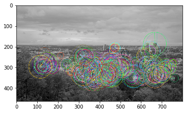
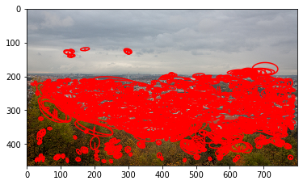
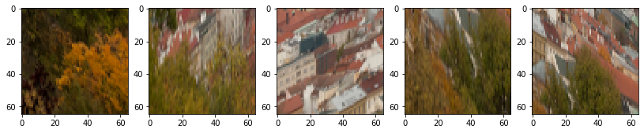
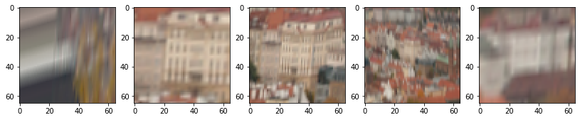

# Extract_patches
> Simple function for local patch extraction from local features keypoints


## Install

`pip install extract_patches`

## How to use

extract_patches accepts following formats:

 - OpenCV keypoints
 - Ellipse format \[x y a b c\], see further in [Oxford-Affine](http://www.robots.ox.ac.uk/~vgg/research/affine/detectors.html#binaries)
 - Affine features format [x y a11 a12 a21 a22], see further [here](https://www.vlfeat.org/overview/frame.html) 
 - OpenCV keypoints + A (a11 a12 a21, a22), say from [AffNet](https://github.com/ducha-aiki/affnet/) output

First, let's delect some local features, e.g. OpenCV ORB.

```
%matplotlib inline
import matplotlib.pyplot as plt
import numpy as np
import cv2
import math
import seaborn as sns
from time import time
from PIL import Image
from extract_patches.core import extract_patches

img1 = cv2.cvtColor(cv2.imread('data/img/prague.png'), cv2.COLOR_BGR2RGB)

det = cv2.ORB_create(500)
kps1, descs1 = det.detectAndCompute(img1,None)

vis_img1 = None
vis_img1 = cv2.drawKeypoints(cv2.cvtColor(img1,cv2.COLOR_RGB2GRAY),kps1,vis_img1, 
                             flags=cv2.DRAW_MATCHES_FLAGS_DRAW_RICH_KEYPOINTS)
plt.imshow(vis_img1)
```


    <matplotlib.image.AxesImage at 0x7feb58b46790>





```
from extract_patches.core import extract_patches
```

extract_patches performs extraction from the appropriate level of image pyramid, removing high freq artifacts. 
Border mode is set to "replicate", so the patch don't have crazy black borders.

**PATCH_SIZE** is output patch size.

**mrSize** is a scale coefficient, related to the image area covered in the original image by local feature.
There are different conventions (if any common), e.g. for ORB is mrSize is recommend to set to 1.0, as kpt.size already contains correct number. For the OpenCV SIFT, on the other hand, one should use mrSize=6.0

```
PATCH_SIZE = 65
mrSize = 1.0
t=time()
patches = extract_patches(kps1, img1, PATCH_SIZE, mrSize, 'cv2')
print ('pyr OpenCV version for 500 kps, [s]', time()-t)

show_idx = 300
fig = plt.figure(figsize=(12, 20))
for i in range(1,6):
    fig.add_subplot(1, 5, i) 
    plt.imshow(patches[show_idx+i])
```

    pyr OpenCV version for 500 kps, [s] 0.025847196578979492


Now try with ellipse (x y a b c) format. Let's download [Hessian-Affine](http://www.robots.ox.ac.uk/~vgg/research/affine/det_eval_files/mikolajczyk_ijcv2004.pdf) from [VGG website](http://www.robots.ox.ac.uk/~vgg/research/affine/detectors.html#binaries) and detect local features with it


```
!rm h_affine.ln
!wget http://www.robots.ox.ac.uk/~vgg/research/affine/det_eval_files/h_affine.ln.gz
!gunzip h_affine.ln.gz
!chmod +x h_affine.ln
!./h_affine.ln  -hesaff -i img/prague.png -o prague.hesaff -thres 100
```

    --2020-01-27 15:21:55--  http://www.robots.ox.ac.uk/~vgg/research/affine/det_eval_files/h_affine.ln.gz
    Resolving www.robots.ox.ac.uk (www.robots.ox.ac.uk)... 129.67.94.2
    Connecting to www.robots.ox.ac.uk (www.robots.ox.ac.uk)|129.67.94.2|:80... connected.
    HTTP request sent, awaiting response... 200 OK
    Length: 3199317 (3.1M) [application/x-gzip]
    Saving to: ‘h_affine.ln.gz’
    
    h_affine.ln.gz      100%[===================>]   3.05M  1.80MB/s    in 1.7s    
    
    2020-01-27 15:21:56 (1.80 MB/s) - ‘h_affine.ln.gz’ saved [3199317/3199317]
    
    hessian affine  detector...
    cgood 1902 cbad 560 all 2462
    cor nb 1679
    detection time: 0.4
    
    number of points : 1562
    output file: prague.hesaff


Now read extracted local features from txt file

```
from extract_patches.laf import visualize_LAFs, ells2LAFs
ells = np.loadtxt('prague.hesaff', skiprows=2).astype(np.float32)
print (f"Shape is {ells.shape}")
print (ells[0:5])
```

    Shape is (1562, 5)
    [[ 1.33920e+02  1.25280e+02  3.40137e-02 -2.62884e-02  9.84345e-02]
     [ 6.63840e+02  1.85760e+02  4.18373e-02  2.33503e-02  7.24527e-02]
     [ 6.78240e+02  1.92960e+02  1.07543e-01 -2.07333e-02  3.04518e-02]
     [ 4.14720e+02  1.98720e+02  3.24049e-02 -3.11269e-03  7.01242e-02]
     [ 5.68800e+02  2.00160e+02  2.22278e-02  3.34806e-02  1.39287e-01]]


Now visualize detected features

```
from extract_patches.laf import visualize_LAFs, ells2LAFs
visualize_LAFs(img1, ells2LAFs(ells))
```





And visualize some patches

```
show_idx=1500
PATCH_SIZE = 65
mrSize = 5.0

t=time()
patches_ells = extract_patches(ells, img1, PATCH_SIZE, mrSize, 'ellipse')
el=time()-t
print (f'extract from ellipse features for 1500 kps, {el:.5f} [s]', )
fig = plt.figure(figsize=(14, 20))
for i in range(1,6):
    fig.add_subplot(1, 5, i) 
    plt.imshow(patches_ells[show_idx+i])

```

    extract from ellipse features for 1500 kps, 0.24170 [s]





Let's try now [MSER](http://cmp.felk.cvut.cz/~matas/papers/matas-bmvc02.pdf) detector, which could output local features in affine format

```
#And lets try x y a11 a12 a21 a22 format. MSER can output in it
!wget http://www.robots.ox.ac.uk/~vgg/research/affine/det_eval_files/mser.tar.gz
!tar -xf mser.tar.gz
!./mser.ln -i img/prague.png -o prague.mser  -t 4
```

    --2020-01-27 15:22:05--  http://www.robots.ox.ac.uk/~vgg/research/affine/det_eval_files/mser.tar.gz
    Resolving www.robots.ox.ac.uk (www.robots.ox.ac.uk)... 129.67.94.2
    Connecting to www.robots.ox.ac.uk (www.robots.ox.ac.uk)|129.67.94.2|:80... connected.
    HTTP request sent, awaiting response... 200 OK
    Length: 558415 (545K) [application/x-gzip]
    Saving to: ‘mser.tar.gz.6’
    
    mser.tar.gz.6       100%[===================>] 545.33K  1.66MB/s    in 0.3s    
    
    2020-01-27 15:22:05 (1.66 MB/s) - ‘mser.tar.gz.6’ saved [558415/558415]
    


Read and extract from MSERs 

```
def read_mser_file(fname):
    with open(fname, 'r') as f:
        out = []
        lines = f.readlines()
        num_feats1 = int(lines[0])
        num_feats2 = int(lines[0+num_feats1+1])
        for l in lines[1:num_feats1]:
            out.append(np.array([float(x) for x in l.strip().split(' ')]).reshape(1,-1))
        for l in lines[num_feats1+2:]:
            out.append(np.array([float(x) for x in l.strip().split(' ')]).reshape(1,-1))
    return np.concatenate(out,axis=0)[:,:6]
mser_xyA = read_mser_file('prague.mser')
print (f"Shape is {mser_xyA.shape}")
print (mser_xyA[0:5])
visualize_LAFs(img1, mser_xyA)
```

    Shape is (361, 6)
    [[ 79.2818   410.027     12.2143    -3.72324   -3.72324    3.38642 ]
     [  6.23611  433.042      7.13002   -1.6485    -1.6485     4.45321 ]
     [546.992    445.621      8.79801    2.71022    2.71022   13.7868  ]
     [659.924    344.894      7.26102    0.842102   0.842102   1.73304 ]
     [651.968    344.841     15.5017     1.13132    1.13132    3.68829 ]]





```
PATCH_SIZE = 65
mrSize = 5.0

t=time()
patches_mser = extract_patches(mser_xyA, img1, PATCH_SIZE, mrSize, 'xyA')
el = time()-t
print (f'extract from a11, a12, a21, a22 features for 360 kps, {el:.5f} [s]')

show_idx=150
fig = plt.figure(figsize=(14, 20))
for i in range(1,6):
    fig.add_subplot(1, 5, i) 
    plt.imshow(patches_mser[show_idx+i])
```

    extract from a11, a12, a21, a22 features for 360 kps, 0.02284 [s]


