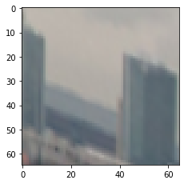

# Extract_patches
> Simple function for local patch extraction from local features keypoints. Accepts following formats:


```python
%load_ext autoreload
%autoreload 2
```

## Install

`pip install extract_patches`

## How to use

Fill me in please! Don't forget code examples:

```python
%matplotlib inline
import matplotlib.pyplot as plt
import numpy as np
import cv2
import math
import seaborn as sns
from time import time
from PIL import Image

img1 = cv2.cvtColor(cv2.imread('img/prague.png'), cv2.COLOR_BGR2RGB)

det = cv2.ORB_create(500)
kps1, descs1 = det.detectAndCompute(img1,None)

vis_img1 = None
vis_img1 = cv2.drawKeypoints(cv2.cvtColor(img1,cv2.COLOR_RGB2GRAY),kps1,vis_img1, 
                             flags=cv2.DRAW_MATCHES_FLAGS_DRAW_RICH_KEYPOINTS)
plt.imshow(vis_img1)
```


    <matplotlib.image.AxesImage at 0x7f5cc8df5ed0>


```python
from extract_patches.core import extract_patches
```

extract_patches performs extraction from the appropriate level of image pyramid, removing high freq artifacts. 
Border mode is set to "replicate", so the patch don't have crazy black borders

```python
show_idx = 300
PATCH_SIZE = 65
mrSize = 5.0
t=time()
patches = extract_patches(kps1, img1, PATCH_SIZE, mrSize, 'cv2')
print ('pyr OpenCV version for 500 kps, [s]', time()-t)
print (kps1[0])

fig = plt.figure(figsize=(12, 16))
fig.add_subplot(1, 3, 1) 
plt.imshow(patches[show_idx])
```

    pyr OpenCV version for 500 kps, [s] 0.02819228172302246
    <KeyPoint 0x7f5cf85b30c0>


    <matplotlib.image.AxesImage at 0x7f5cc8d3a490>


```python
#Now try with ellipse (x y a b c) format. Let`s download hessian affine from VGG website
!rm h_affine.ln
!wget http://www.robots.ox.ac.uk/~vgg/research/affine/det_eval_files/h_affine.ln.gz
!gunzip h_affine.ln.gz
!chmod +x h_affine.ln
```

    rm: cannot remove 'h_affine.ln': No such file or directory
    --2020-01-27 13:14:42--  http://www.robots.ox.ac.uk/~vgg/research/affine/det_eval_files/h_affine.ln.gz
    Resolving www.robots.ox.ac.uk (www.robots.ox.ac.uk)... 129.67.94.2
    Connecting to www.robots.ox.ac.uk (www.robots.ox.ac.uk)|129.67.94.2|:80... connected.
    HTTP request sent, awaiting response... 200 OK
    Length: 3199317 (3.1M) [application/x-gzip]
    Saving to: ‘h_affine.ln.gz’
    
    h_affine.ln.gz      100%[===================>]   3.05M  4.51MB/s    in 0.7s    
    
    2020-01-27 13:14:43 (4.51 MB/s) - ‘h_affine.ln.gz’ saved [3199317/3199317]
    


```python
!./h_affine.ln  -hesaff -i img/prague.png -o prague.hesaff -thres 100
```

    hessian affine  detector...
    cgood 1902 cbad 560 all 2462
    cor nb 1679
    detection time: 0.366667
    
    number of points : 1562
    output file: prague.hesaff


```python
ells = np.loadtxt('prague.hesaff', skiprows=2).astype(np.float32)
print (ells.shape, ells[0])

t=time()
patches_ells = extract_patches(ells, img1, PATCH_SIZE, mrSize, 'ellipse')
print ('extract from ellipse features for 1500 kps, [s]', time()-t)

fig = plt.figure(figsize=(12, 16))
fig.add_subplot(1, 3, 1) 
plt.imshow(patches_ells[1000])
```

    (1562, 5) [ 1.33920e+02  1.25280e+02  3.40137e-02 -2.62884e-02  9.84345e-02]
    extract from ellipse features for 1500 kps, [s] 0.17285490036010742


    <matplotlib.image.AxesImage at 0x7f5cc80905d0>





```python
#And lets try x y a11 a12 a21 a22 format. MSER can output in it
!wget http://www.robots.ox.ac.uk/~vgg/research/affine/det_eval_files/mser.tar.gz
!tar -xf mser.tar.gz
```

    --2020-01-27 13:17:56--  http://www.robots.ox.ac.uk/~vgg/research/affine/det_eval_files/mser.tar.gz
    Resolving www.robots.ox.ac.uk (www.robots.ox.ac.uk)... 129.67.94.2
    Connecting to www.robots.ox.ac.uk (www.robots.ox.ac.uk)|129.67.94.2|:80... connected.
    HTTP request sent, awaiting response... 200 OK
    Length: 558415 (545K) [application/x-gzip]
    Saving to: ‘mser.tar.gz’
    
    mser.tar.gz         100%[===================>] 545.33K  2.72MB/s    in 0.2s    
    
    2020-01-27 13:17:56 (2.72 MB/s) - ‘mser.tar.gz’ saved [558415/558415]
    


```python
#Extraction
!./mser.ln -i img/prague.png -o prague.mser  -t 4

def read_mser_file(fname):
    with open(fname, 'r') as f:
        out = []
        lines = f.readlines()
        num_feats1 = int(lines[0])
        num_feats2 = int(lines[0+num_feats1+1])
        for l in lines[1:num_feats1]:
            out.append(np.array([float(x) for x in l.strip().split(' ')]).reshape(1,-1))
        for l in lines[num_feats1+2:]:
            out.append(np.array([float(x) for x in l.strip().split(' ')]).reshape(1,-1))
    return np.concatenate(out,axis=0)[:,:6]
mser_xyA = read_mser_file('prague.mser')
print (mser_xyA.shape, mser_xyA[0])
```

    (361, 6) [ 79.2818  410.027    12.2143   -3.72324  -3.72324   3.38642]


```python
t=time()
patches_mser = extract_patches(mser_xyA, img1, PATCH_SIZE, mrSize, 'xyA')
print ('extract from a11, a12, a21, a22 features for 360 kps, [s]', time()-t)

fig = plt.figure(figsize=(12, 16))
fig.add_subplot(1, 3, 1) 
plt.imshow(patches_mser[153])
```

    extract from a11, a12, a21, a22 features for 360 kps, [s] 0.031371116638183594


    <matplotlib.image.AxesImage at 0x7f5cc1ebef90>


